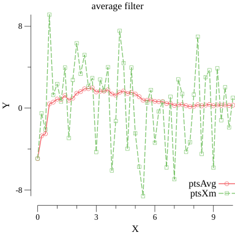
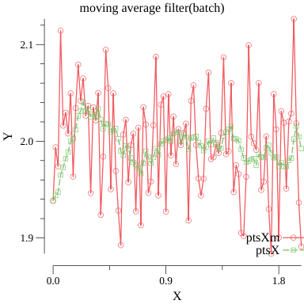

# Kalman Filter in Golang

I'm following examples of Korean book **칼만필터의 이해(MATLAB활용)** [LINK](http://www.kyobobook.co.kr/product/detailViewKor.laf?barcode=9788957613047) (Understanding KalmanFilter with Matlab). I'm referencing work of **Kalman Filter in Python** ([GIT](https://github.com/tbmoon/kalman_filter)). For detailed info, you should refer that git repo.


## To run

```bash
## run ch01
go run ./Ch01.AverageFilter/run_avg_filter.go

## run ch02
go run ./Ch02.MovingAverageFilter/run_moving_average_filter.go

## run ch03
 go run ./Ch03.LowPassFilter/run_lpf.go

```


## Run res

### Ch1. Avgerage Filter



### Ch2. Moving Avgerage Filter




## License

"THE ROOT BEER LICENSE" (Revision 2):

[sikbrad@gmail.com](mailto:sikbrad@gmail.com) wrote this file. As long as you retain this notice you can do whatever you want with this stuff. If we meet some day, and you think this stuff is worth it, you can buy me a root beer in return.